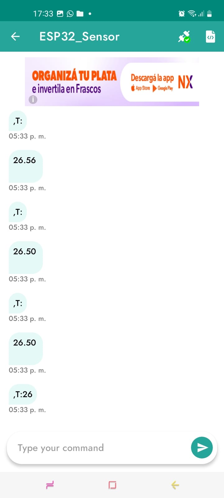
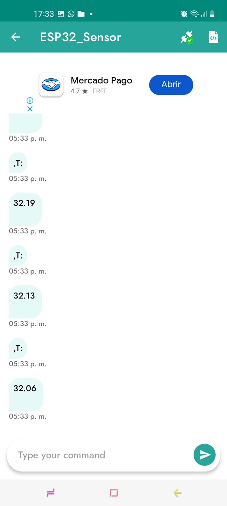

## PROYECTO-1 CON SENSOR DS18B20

En este proyecto se utiliza un sensor de temperatura DS18B20 conectado a un ESP32, que controla dos LEDs en función de la temperatura ambiente. Además, mediante comandos de voz enviados por la app Arduino Bluetooth Controller, se puede encender o apagar un extractor (simulado con un LED). También se muestra en tiempo real el valor de la temperatura en un dashboard.

# Aplicacion Utilizada

Se utiliza la app Arduino Bluetooth Controller (disponible para Android) para:

Visualizar los datos de temperatura transmitidos por el ESP32.

Enviar comandos por voz o texto al ESP32 para controlar el extractor.

Se muestra la información en tiempo real mediante el modo Dashboard de la app.

# Requisitos para su uso

Placa ESP32 DevKit

Sensor de temperatura DS18B20

Resistencias

2 LEDs (uno para la temperatura, otro para el extractor)

Aplicación Arduino Bluetooth Controller 

IDE PlatformIO 

# Las conexiones

Componente	Pin ESP32
DS18B20 (Data)	GPIO 4
LED Temperatura	GPIO 22
LED Extractor	GPIO 23

# Las librerias

OneWire.h

DallasTemperature.h

BluetoothSerial.h 

# Su funcionamiento

Sensor de Temperatura (DS18B20)
El sensor mide la temperatura en tiempo real y toma acciones automáticas con base a los siguientes rangos:

0°C a 24°C: El LED de temperatura permanece apagado.

25°C a 30°C: El LED de temperatura se enciende de forma constante.

31°C a 50°C: El LED de temperatura parpadea, indicando temperatura elevada.

# La visualizacion de datos

El ESP32 transmite continuamente los valores de temperatura vía Bluetooth.

La app Arduino Bluetooth Controller los recibe y muestra en su panel de control (Dashboard).

Control por Voz (Bluetooth)
El ESP32 actúa como servidor Bluetooth bajo el nombre ESP32_Sensor. Puedes conectarte desde la app y usar comandos de voz para controlar el LED del extractor.

# Lo comandos de voz

"encender extractor": Enciende el LED del extractor.

"apagar extractor": Apaga el LED del extractor.

Los comandos pueden ser dictados desde el botón de micrófono de la app. El código los reconoce ignorando mayúsculas, minúsculas y espacios adicionales.

# Como se ejecuta el programa

Al iniciar el ESP32:

Se inicializa el sensor y la conexión Bluetooth.

Se lee la temperatura cada segundo.

Se transmite a la app conectada.

Según el valor:

Se controla el estado del LED de temperatura.

Si se recibe un comando por voz desde la app:

Se interpreta y actúa sobre el LED del extractor.

# PROTOTIPO

